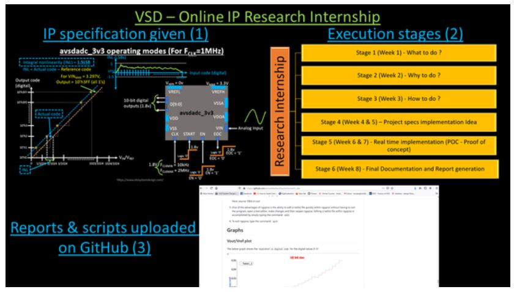
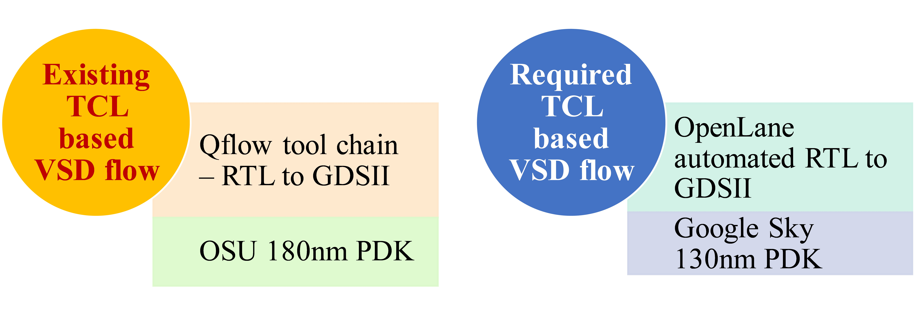

# TCLbasedVSDflow_Internship2021
The internship to develop IP/VLSI system design flow at $0 cost using opensource EDA tools are being organized by https://www.vlsisystemdesign.com/ip/ . This is very good opportunity to develop skillset by doing projects on your own and implement ideas. The project topic is "TCL based 'vsdflow' for OpenLANE/Sky130" wherein VLSI system design flow (RTL to GDSII) needs to be developed using TCL scripting on OpenLANE platform using Google's free process design kit (PDK) sky130A.
# Content
  ### 1. About the project
  ### 2. Problem statement and methodology
  ### 3. Initial steps and TCL scripting 
  ### 4. OpenLANE and Sky130A PDK
  ### 5. Pre-layout and timing analysis
  ### 6. Post-layout
  
# 1. About the Project
- VSDFLOW is an automated framework of RTL to GDSII flow built completely using open source EDA tools and PDKs with it’s final hardware presenting performance–area metrics of the design. Different open-source tools are used at each stage of the physical design flow. OpenLANE is accelerating through the industry that provides various opensource EDA tools at one place wherein the complete VSDFLOW (RTL to GDSII) can be performed. Hence, by using the TCL (Tool Command Language) scripting the VSDFLOW can be automated. In this project, OpenLANE will be used for performing the VSDFLOW through TCL scripting and Google's Skywater 130nm PDK will be used for the CMOS circuit named SPI Slave design.

- ### Prerequisites:
- 1) git clone https://github.com/kunalg123/vsdflow.git 
- 2) Online courses to inderstand TCL scripting

TCL scripting part 1:
https://www.udemy.com/vsd-tcl-programming-from-novice-to-expert/

TCL scripting part 2:
https://www.udemy.com/vsd-tcl-programming-from-novice-to-expert-part-2/

# 2. Problem statement and methodology
- Recently, VSD flow using OSU 180nm PDK on Qflow toolset is reported wherein TCL scripting has been performed meticulously which provides an automated solution to evaluate power-performance-area (PPA) major components of the design. However, OpenLANE in new and more user-friendly toolset to perform RTL to GDSII flow in collaboration with Google’s Skywater 130nm PDK. hence, in this project, the mapping is carried out that explains a) the VSDFlow using OpenLANE toolset with Skywater 130nm technology node and b) How Qflow and OSU 180nm PDK can be mapped to OpenLANE and Sky 130nm PDK, respectively. A simple mapping is presented hereby:

- The methodology for the project is shown hereby:

# 3. Initial steps and TCL scripting
- At first, literature survey is carried out for VSDFlow and TCL scripting. The reported work of TCL scripting using Qflow/OSU180 is studied. The design selected in this work is SPI slave.
- The initial step was to use the sky 130nm PDK/library files. Accordinlgy, the CSV file (named: spi_slave_design_details.csv) is updated wherein mainly the library path for Early and Late library path were modifed as (Path of sky130 library found in OpenLANE toolset):
- ~/vsdflow/work/tools/openlane_working_dir/pdks/sky130A/libs.ref/sky130_fd_sc_hd/lib/sky130_fd_sc_hd__tt_025C_1v80.lib

- In order to check the correct paths for Design name, verilog code (spi_slave.v), Early library path, Late library path, and Output directory, one can use 'return' statement in vsdflow.tcl file after defining the directory/path for each of these.

- The TCL scripting should mainly include 

a) defining CSV file contents and accordingly show error messages to user if any.
b) defining heirarchy check and Synthesis details to perform synthesis using open source tool Yosys. 
c) Static timing analysis details/script that will be performed using Opentimer opensource tool.

### Prelayout analysis:
- Prelayout consist of synthesis, initial PNR, and Static timing analysis. hence, after writing the whold VSDflow TCL script these can be analysed by putting 'return' statement ater STA script section.

- To edit the vsdflow.tcl file, use command (in VSDFLOW directory):
+ vim vsdflow.tcl

- These steps will be run through the TCL scripting using the command:
- ./vsdflow spi_slave_design_details.csv

- The synthesis and STA files will be generated afterward. These can be seen in synthesis folder of Output directory.

- The initial RTL of the SPI slave design is generated after synthesis wherein the GATE level architecture (containing sky130 standard cells) can be seen. 
